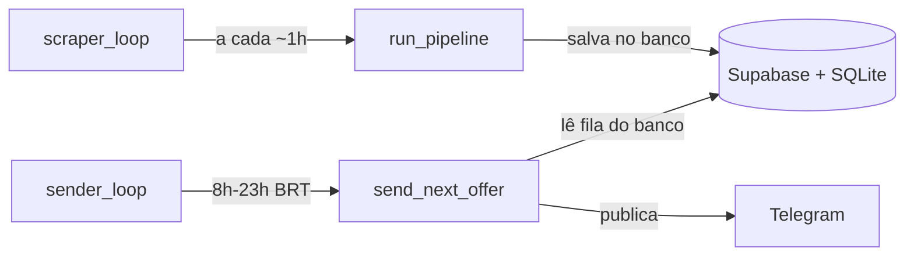
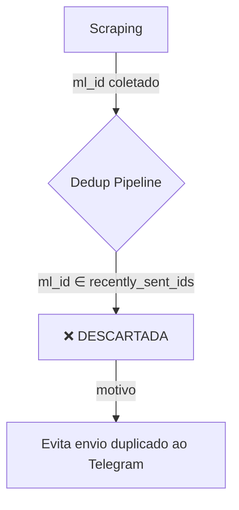
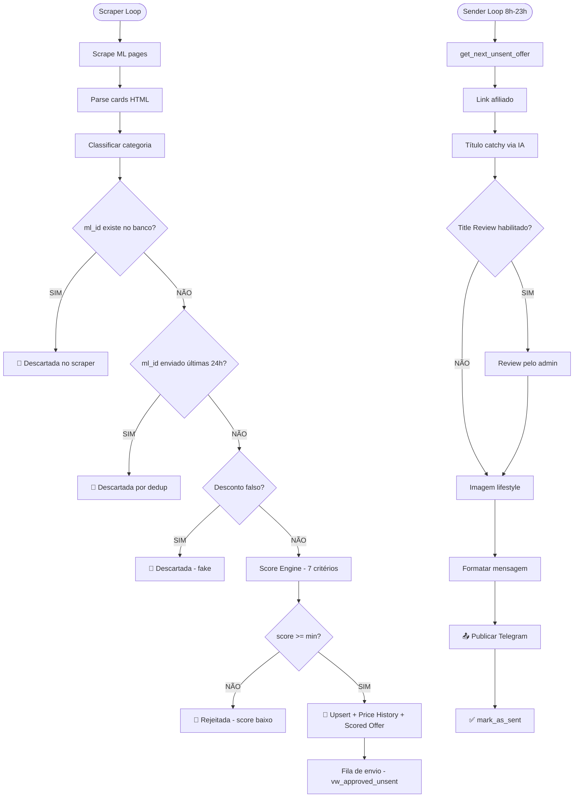

# Fluxo Completo de Ofertas — Crivo

## Visão Geral da Arquitetura

O sistema roda **2 loops paralelos** em [runner.py](file:///Users/andreresende/Apps/crivo/src/runner.py):

---

## 🟢 Cenário 1: Oferta Nova

Uma oferta que **nunca foi vista** pelo sistema.

### Etapa 1 — Scraping
> [ml_scraper.py](file:///Users/andreresende/Apps/crivo/src/scraper/ml_scraper.py)

1. `MLScraper.scrape()` navega pelas fontes de [ml_categories.json](file:///Users/andreresende/Apps/crivo/ml_categories.json) (Ofertas do Dia, categorias, etc.)
2. Para cada página, parseia o HTML e extrai os campos do card ([_parse_item](file:///Users/andreresende/Apps/crivo/src/scraper/ml_scraper.py#559-648)):
   - `ml_id`, [url](file:///Users/andreresende/Apps/crivo/src/scraper/ml_scraper.py#420-423), [title](file:///Users/andreresende/Apps/crivo/src/analyzer/score_engine.py#426-473), [price](file:///Users/andreresende/Apps/crivo/src/scraper/ml_scraper.py#653-690), [original_price](file:///Users/andreresende/Apps/crivo/src/scraper/ml_scraper.py#716-741), `pix_price`, `discount_pct`, [rating](file:///Users/andreresende/Apps/crivo/src/scraper/ml_scraper.py#777-788), [review_count](file:///Users/andreresende/Apps/crivo/src/scraper/ml_scraper.py#789-799), [free_shipping](file:///Users/andreresende/Apps/crivo/src/scraper/ml_scraper.py#539-545), `installments_without_interest`, [badge](file:///Users/andreresende/Apps/crivo/src/analyzer/score_engine.py#398-405), [image_url](file:///Users/andreresende/Apps/crivo/src/scraper/ml_scraper.py#553-558)
3. Classifica a categoria do produto via heurística (`get_product_category`) e, se "Outros", enriquece via LLM (`classify_with_ai`)
4. **Dedup inline no scraper**: [_save_page_products_batch](file:///Users/andreresende/Apps/crivo/src/scraper/ml_scraper.py#357-391) chama [check_duplicates_batch](file:///Users/andreresende/Apps/crivo/src/database/supabase_client.py#273-290) → como é nova, o `ml_id` **NÃO existe** no banco → produto passa

### Etapa 2 — Dedup no Pipeline
> [pipeline.py](file:///Users/andreresende/Apps/crivo/src/scraper/pipeline.py) → [_filter_products](file:///Users/andreresende/Apps/crivo/src/scraper/pipeline.py#53-78)

1. [get_recently_sent_ids(hours=24)](file:///Users/andreresende/Apps/crivo/src/database/supabase_client.py#572-592) retorna os `ml_ids` que foram **enviados** nas últimas 24h
2. A oferta nova **NÃO está** nesse set → **passa** no filtro de dedup
3. Resultado: a oferta continua no pipeline

### Etapa 3 — Filtro de Desconto Falso
> [fake_discount_detector.py](file:///Users/andreresende/Apps/crivo/src/analyzer/fake_discount_detector.py)

1. Verifica 5 heurísticas para detectar "pricejacking":
   - Razão preço original/atual > 5x
   - Desconto > 80%
   - Preço original suspeito (redondo)
   - Desconto informado ≠ calculado (> 5% diferença)
   - Padrão preço centavos vs. original redondo
2. Se `confidence >= 0.6` → marcada como **fake** e **descartada**
3. Oferta genuína → segue

### Etapa 4 — Score Engine
> [score_engine.py](file:///Users/andreresende/Apps/crivo/src/analyzer/score_engine.py)

1. **Hard filters** (eliminação imediata): desconto mínimo, rating mínimo, reviews mínimos, preço > 0, título > 10 chars
2. **7 critérios pontuados** (soma = 100):

| Critério | Peso | Tipo |
|---|---|---|
| Desconto (%) | 30 pts | Sigmoid |
| Badge | 15 pts | Discreto |
| Rating | 15 pts | Linear |
| Reviews | 10 pts | Logarítmico |
| Frete grátis | 10 pts | Binário |
| Parcelamento s/ juros | 10 pts | Binário |
| Qualidade do título | 10 pts | Heurísticas |

3. **Redistribuição dinâmica**: se um critério não tem dados (ex: sem rating), seu peso é redistribuído entre os demais
4. Se `score >= min_score` → **aprovada** ✅
5. Se `score < min_score` → **rejeitada** ❌ (motivo registrado)

### Etapa 5 — Persistência
> [pipeline.py](file:///Users/andreresende/Apps/crivo/src/scraper/pipeline.py) → [_save_approved](file:///Users/andreresende/Apps/crivo/src/scraper/pipeline.py#191-240)

1. [upsert_products_batch](file:///Users/andreresende/Apps/crivo/src/database/supabase_client.py#291-338) → insere no Supabase com `ON CONFLICT ml_id` (cria novo registro) e espelha no SQLite
2. [add_price_history_batch](file:///Users/andreresende/Apps/crivo/src/database/storage_manager.py#491-534) → registra preço atual no histórico
3. [save_scored_offers_batch](file:///Users/andreresende/Apps/crivo/src/database/storage_manager.py#634-677) → cria [scored_offer](file:///Users/andreresende/Apps/crivo/src/database/supabase_client.py#438-478) com `status = "approved"`
4. [_build_affiliate_links](file:///Users/andreresende/Apps/crivo/src/scraper/pipeline.py#135-164) → gera link de afiliado via API do ML

### Etapa 6 — Envio (sender_loop)
> [sender.py](file:///Users/andreresende/Apps/crivo/src/distributor/sender.py) → [send_next_offer](file:///Users/andreresende/Apps/crivo/src/distributor/sender.py#322-425)

1. [get_next_unsent_offer()](file:///Users/andreresende/Apps/crivo/src/database/storage_manager.py#790-799) → consulta view `vw_approved_unsent` (maior score primeiro)
2. Gera link de afiliado (ou reutiliza existente)
3. Gera título catchy via IA (OpenRouter/Haiku)
4. (Opcional) Revisão do título pelo admin via Telegram Bot
5. Gera/reutiliza imagem lifestyle via IA + upload Supabase Storage
6. Formata mensagem (Style Guide v3)
7. Valida mensagem (soft check)
8. Publica no Telegram
9. [mark_as_sent(scored_offer_id, "telegram")](file:///Users/andreresende/Apps/crivo/src/database/storage_manager.py#691-719) → registra na tabela `sent_offers`

---

## 🔵 Cenário 2: Oferta que Já Apareceu Antes

Uma oferta cujo `ml_id` **já existe** no banco (já foi scrapeada em ciclos anteriores).

### Subcenário 2A — Já Foi Enviada nas Últimas 24h

1. **Scraping**: o scraper extrai normalmente os dados do card
2. **Dedup inline no scraper**: [check_duplicates_batch](file:///Users/andreresende/Apps/crivo/src/database/supabase_client.py#273-290) → `ml_id` **EXISTE** no banco → **descartada no scraper** (não entra em `new_products`)
3. Mesmo que passasse do scraper: no pipeline, [get_recently_sent_ids(24h)](file:///Users/andreresende/Apps/crivo/src/database/supabase_client.py#572-592) retornaria esse `ml_id` → **filtrada**
4. **A oferta NÃO é processada** — é silenciosamente ignorada

### Subcenário 2B — Existe no Banco, mas NÃO Foi Enviada Recentemente (> 24h)

> [!IMPORTANT]
> Este cenário **não acontece** no fluxo atual do pipeline, por um detalhe sutil.

O [check_duplicates_batch](file:///Users/andreresende/Apps/crivo/src/database/supabase_client.py#273-290) no scraper verifica se o `ml_id` **existe na tabela products** (sem limite temporal). Portanto:

1. **Scraping**: card é extraído normalmente
2. **Dedup inline no scraper** ([_save_page_products_batch](file:///Users/andreresende/Apps/crivo/src/scraper/ml_scraper.py#357-391)): [check_duplicates_batch](file:///Users/andreresende/Apps/crivo/src/database/supabase_client.py#273-290) → `ml_id` **encontrado** → **descartada aqui mesmo**
3. A oferta **nunca chega** ao pipeline de [_filter_products](file:///Users/andreresende/Apps/crivo/src/scraper/pipeline.py#53-78) / score / save

**Em resumo**: uma vez que um produto é registrado no banco, ele é **permanentemente ignorado** pelo scraper em ciclos futuros, independentemente de quando foi enviado.

### Subcenário 2C — Já Foi Scored e Aprovada, Mas Ainda Não Enviada

Se o produto foi salvo como [scored_offer](file:///Users/andreresende/Apps/crivo/src/database/supabase_client.py#438-478) com `status = "approved"` mas ainda não foi enviado:

1. A view `vw_approved_unsent` retorna essa oferta quando o [sender_loop](file:///Users/andreresende/Apps/crivo/src/runner.py#163-213) chama [get_next_unsent_offer()](file:///Users/andreresende/Apps/crivo/src/database/storage_manager.py#790-799)
2. O sender processa normalmente (link afiliado → título → imagem → Telegram → mark_as_sent)
3. Isso acontece quando o sistema foi parado entre o scraping e o envio

---

## Resumo Visual Completo

> [!NOTE]
> O duplo filtro (scraper + pipeline) é redundante por design. O filtro do scraper ([check_duplicates_batch](file:///Users/andreresende/Apps/crivo/src/database/supabase_client.py#273-290)) pega **todos** os produtos existentes no banco. O filtro do pipeline ([get_recently_sent_ids](file:///Users/andreresende/Apps/crivo/src/database/supabase_client.py#572-592)) pega apenas os **enviados nas últimas 24h**. Na prática, o filtro do scraper é mais restritivo e sempre atua primeiro.
